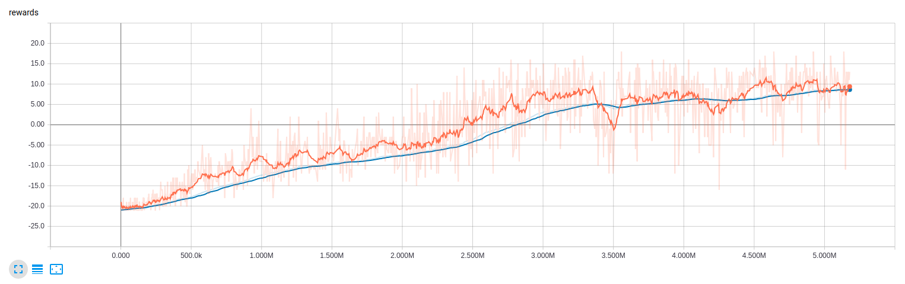

# DQN pytorch
A pytorch implement of DQN.

## Dependencies
- python 3  
- pytorch 0.4  
- numpy  
- gym  

Use `pip` to install what you need.

## Usage
Just type `python dqn.py` in Terminal.

## Training
After about 3M frames (100h) of training, the agent can beat the ai in the
original atari game most of the time.


## Test
Finally, I test the agent in 100 games and the result is as below:
```
Episode 91/100 (win/total) Running mean 9.554
```
